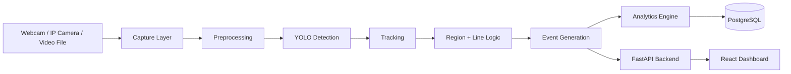

# Real-Time Computer Vision App

A portfolio-ready real-time computer vision analytics application built with Python, OpenCV, Ultralytics YOLO, FastAPI, PostgreSQL, and a lightweight React dashboard. The project is designed to support live webcam and IP camera sources, object detection, tracking, counts, analytics, and event generation.

## Overview

This project demonstrates an end-to-end CV pipeline:

Camera / Webcam
→ Video capture
→ Frame preprocessing
→ Object detection
→ Object tracking
→ Region and line logic
→ Event generation
→ Analytics
→ Database
→ Dashboard

## Problem Statement

Many CV projects stop at a static demo or notebook. This repository focuses on building a real-world system capable of real-time performance, configurable model selection, and backend analytics that can be demonstrated in an interview or portfolio.

## Key Features

- Live video acquisition from webcam or IP streams
- Real-time object detection with YOLO
- Object tracking across frames
- Unique tracking IDs
- Region-based entry/exit analytics
- Event storage and dashboard display
- FastAPI backend with modular routes
- PostgreSQL integration-ready configuration
- Docker Compose setup for local orchestration
- Testing for core pipeline behavior
- Clear architecture for future extensibility

## Architecture



## Project Structure

```text
real-time-cv-analytics/
├── backend/
│   ├── app/
│   │   ├── api/
│   │   │   ├── routes/
│   │   │   └── __init__.py
│   │   ├── core/
│   │   │   └── config.py
│   │   ├── cv/
│   │   │   ├── analytics/
│   │   │   ├── detector/
│   │   │   ├── preprocessing/
│   │   │   ├── tracker/
│   │   │   └── visualization/
│   │   ├── database/
│   │   ├── workers/
│   │   ├── __init__.py
│   │   └── main.py
│   ├── tests/
│   ├── requirements.txt
│   ├── Dockerfile
│   └── pytest.ini
├── frontend/
│   ├── src/
│   ├── package.json
│   ├── vite.config.js
│   ├── Dockerfile
│   └── index.html
├── .env.example
├── docker-compose.yml
├── README.md
├── LICENSE
└── .gitignore
```

## Computer Vision Pipeline

1. Capture frames from camera or video input
2. Resize and normalize frame data
3. Run object detection with a YOLO-style detector
4. Filter low-confidence predictions
5. Apply non-max suppression as needed
6. Match detections to tracking IDs
7. Evaluate entry/exit lines and regions
8. Generate analytics and event records
9. Render annotated video frames
10. Persist aggregated results to a database

## Model Explanation

Object detection finds and classifies objects in an image or frame. YOLO performs detection in a single forward pass, making it well-suited for real-time video workloads. It predicts bounding boxes and class probabilities at once, then filters predictions by confidence and IoU.

Key concepts:

- Bounding box: a rectangular region around an object
- Confidence score: how likely the model thinks a prediction is correct
- IoU: Intersection over Union, used to compare overlap between boxes
- NMS: Non-Maximum Suppression removes duplicate boxes around the same object
- FPS: frames processed per second
- Precision/Recall: how often predictions are correct and how completely objects are found

## Tracking Explanation

Tracking keeps a consistent identity for an object across multiple frames. The project uses a lightweight tracker abstraction and is structured so a production tracker such as ByteTrack, BoT-SORT, or DeepSORT can be plugged in later. This matters because detection alone does not maintain object identity over time.

## Technology Stack

- Python
- FastAPI
- OpenCV
- Ultralytics YOLO
- PostgreSQL
- SQLAlchemy
- React + Vite
- Docker / Docker Compose
- Pytest

## Installation

### Prerequisites

- Python 3.11+
- Node.js 18+
- Docker and Docker Compose
- PostgreSQL (optional for local development)

### Backend setup

```bash
cd backend
python -m venv .venv
source .venv/bin/activate
pip install -r requirements.txt
uvicorn app.main:app --reload --host 0.0.0.0 --port 8000
```

### Frontend setup

```bash
cd frontend
npm install
npm run dev -- --host 0.0.0.0
```

### Environment

Copy the sample environment:

```bash
cp .env.example .env
```

## Docker Setup

```bash
docker compose up --build
```

The stack includes:

- Backend service on port 8000
- Frontend service on port 3000
- PostgreSQL on port 5432

## GPU Setup

This project is designed to auto-detect GPU availability. The detector can run on CUDA when available and fall back to CPU automatically. If you have NVIDIA drivers and the CUDA runtime installed, the Ultralytics model can use GPU acceleration with little change to the codebase.

## API Overview

Available routes include:

- POST /camera/start
- POST /camera/stop
- GET /camera/status
- GET /detections
- GET /tracks
- GET /analytics
- GET /events
- GET /health
- GET /metrics
- POST /settings

## Testing

Run the test suite:

```bash
cd backend
pytest -q
```

The included tests cover:

- preprocessing
- tracking ID assignment
- event generation
- annotation rendering

## Performance and Optimization

This project is structured with optimization in mind:

- configurable frame sizing
- skip-frame control
- model size selection
- asynchronous API design
- CPU/GPU device selection
- efficient OpenCV preprocessing
- modular detector and tracker layers

## Deployment

The application is containerized for local or cloud deployment. For production, you would typically:

- use a managed Postgres instance
- set secrets through environment variables
- expose the backend behind a reverse proxy
- add authentication and rate limiting
- deploy the frontend as a static app or SSR project

## Limitations

This is an intentionally production-leaning scaffold, not a fully optimized enterprise control room. Core features like region drawing, robust tracker integration, and long-lived event persistence are implemented as modular building blocks and can be expanded.

## Future Improvements

- real ByteTrack / DeepSORT integration
- database models and migrations
- camera source validation and stream management
- event clips and video retention
- live charts with real time streaming
- authentication and authorization
- advanced occupancy analytics